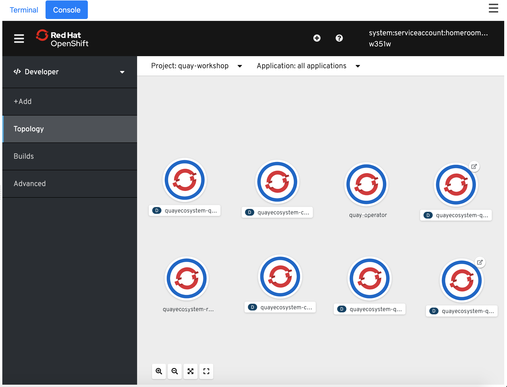
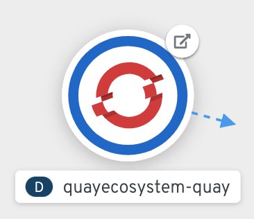
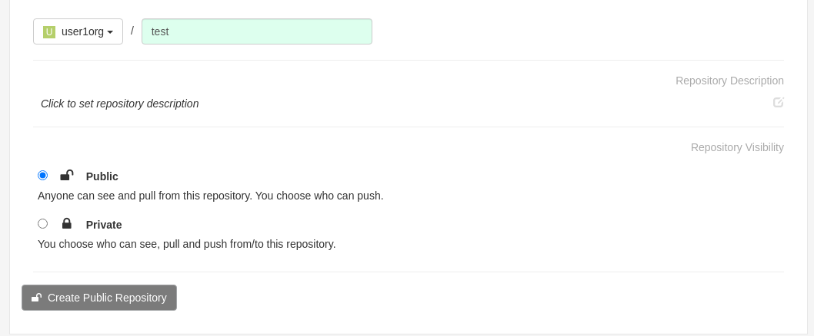

## Create Quay Dependencies

TODO: Images

Quay installs on RH OpenShift using the RH Quay Operator. Because the installation of an Operator requires cluster-admin priviliges, this part of the lab has been completed for you ahead of time. We have installed the Red Hat Quay Operator into the `quay` namespace in your cluster. This Operator is monitoring the `quay` namespace and awaiting a request for a Quay object to be requested. To do this, we'll need to feed OpenShift a handful of Kubernetes manifests that describe how we want our Quay object to look and behave. Take a look in the `Console` tab above the right hand pane of this lab guide. 

- Click the dropdown on the left of the OpenShift Console that says `Developer` and change this to `Administrator`.
- Change your project to `quay` in the middle of the OpenShift console.
- From the left hand navigation accordion of the console pane, expand `Operators` and then click on `Installed Operators`.
- By clicking on the `Red Hat Quay` Operator instance you can explore the basic information provided for the Quay Operator to include the description, features, prerequisites and an example of a simplified deployment.

From within the Red Hat Quay Operator, click on `Events`. From here you can see all events associated with the operator and any instance of Quay it is managing. For example, if you're creating and instance of Quay and it's not deploying as expected, this is a great place to start investigating the error message(s). Currently, because this is a brand new cluster, you're only seeing the messages related to rolling out the operator itself.

### Let's deploy Quay

First, you will need to create the quay secrets.

Create a generic secret for the Quay database credentials:
```execute
oc create secret generic quay-database-credential \
  --from-literal=database-username=quay \
  --from-literal=database-password="openshift" \
  --from-literal=database-root-password="openshift" \
  --from-literal=database-name=quay-enterprise
```

Create the Quay super user credentials:
```execute
oc create secret generic quay-super-user \
  --from-literal=superuser-username=quay \
  --from-literal=superuser-password="openshift" \
  --from-literal=superuser-email=user1@redhat.com
```

Create the Quay config app secret
```execute
oc create secret generic quay-config-app \
  --from-literal=config-app-password="openshift"
```

Create the Quay Redis password:
```execute
oc create secret generic quay-redis-password \
  --from-literal=password="openshift"
```

Inspect the contents of the helper script provided to create the pre-requisite OpenShift objects to deploy Quay 3.3.
```execute
cat install-script
```

Run the script to create create the pre-reqs.

```execute
./install-script
```

Please give your email address, desired username, and password. Note: Your email address is not used for any communication. You will need to remember the username and password you provide to the install-script as these will be used to login to your deployed instance of Quay.


Please allow up to 5 minutes for all instances of quay to come up. When complete, it should look like the image below. Notice how all pods are showing a dark blue ring to indicate they are reporting a healthy and ready state.


This workshop is using a project called homeroom to bundle all web services into a single dashboard. This makes for a simple unified experience when following this lab guide. By default, Quay does not support running from within an iFrame. iFrames are the specific mechanism used by this homeroom project to display the various web services in a tabulated pane. To allow iFrames, we'll need to patch the Quay deployment with the following command:
```execute
oc patch deployments/quayecosystem-quay -n quay -p '{"spec":{"template":{"spec":{"containers":[{"name":"quay-enterprise-app","image":"quay.io/redhatgov/quay-3.3-xframe-allow:latest"}]}}}}'
```
Check your topology view in the Quay project. You should see the Quay pod rolling out a new instance. Once this pod is healthy you're free to proceed.


## Login to Quay
You may have noticed the Quay tab available on the right side of the dashboard. Because it was loaded prior to your deployment of a Quay instance, it's displaying an error message. To remedy this (Once all pods are up), please refresh your browser window.




_______________________________________________________________________________________________________________

Once logged in, you'll be presented with the Quay dashboard. Notice a few things here true of a new user:


* Quay presents 3 Links at the top of the page (EXPLORE, REPOSITORIES, and TUTORIAL). The `TUTORIAL` link walks you through the full cycle of pushing an image into your Quay instance. This is great any time you need a quick refresher.
* You have no `Organizations` created. However, you can create repositories under your username, which acts somewhat like an Organization.
* The UI is prompting you to `Create New Organization` on the right.

*Note: Organization names must be globally unique to your Quay instance. For example, if you attempt to create an organization named `user1`, Quay will prevent you from creating this Org, because by default, each user starts with an org created in their account using their username. Repositories, however, are only required to be unique within a given organizations namespace. As an example the following two repos can co-exist without collision:*

```
myquay.com/user1/repo1

myquay.com/user2/repo1
```

## Create an Organization
Let's start by creating an Organization.
* Click - `Create New Organization`


* Name this Organization `user1`.


* Click `Create Organization`


## Create a Repository


* Click `Create New Repository` in the top right of the UI.

* Ensure `user1` is selected in the drop down list of Organizations.

* Name the organization `test`.

* Change the `Repository Visibility` to `Public`.

* Optionally, set a repository description by clicking in and changing the default text that states `Click to set repository description`

* Click `Create Public Repository`



* Navigate back to the dashboard by clicking the `RED HAT QUAY` icon in the top left of the page.
* Notice you now have two organizations, `user1` and `user1`. Your `user1` organization contains one repository named `test`.
