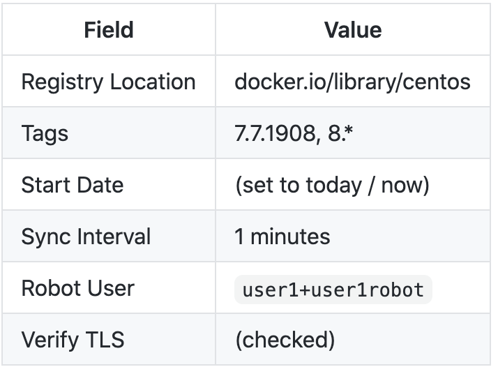

# Lab 2 - Repo Mirroring
In this lab, we'll create a repository that automatically mirrors images located somewhere else. Quay can mirror images from any container registry it can reach and has appropriate credentials to. This is useful in a number of scenarios:
* caching local copies of baselayer images to reduce network traffic on your WAN link
* making a subset of images available to your developer team to choose from (discouraging grabbing random images from the internet)
* As part of an image building or scanning pipeline
* Establishing read only image namespaces

For our example, we'll make a mirror of an older Centos7 image that we can find CVE's in when using the Clair image scanner in later labs.

When a repository is set to be a mirror, you cannot `push` an image directly to this repo. Instead, Quay will reach out and `pull` from the location you've designated, and grab all tags specified in the repo mirror settings.

## Create a repo to mirror from


* Click `Create New Repository` in the top right of the UI.

* Ensure `user1` is selected in the drop down list of Organizations.

* Name the organization `centos-mirror`.

* Change the `Repository Visibility` to `Public`.

* Optionally, set a repository description by clicking in and changing the default text that states `Click to set repository description`

* Click `Create Public Repository`


* Click the `Settings` icon as shown above
* Under the `Repository State` section, change the repo state in the dropdown to `Mirror`. 


* Click the `Mirroring` icon as shown above
* You should now see the `Repository Mirroring` configuration page.
* Beside the `Robot User` field, select the down arrow and click `Create robot accounts`. We'll need this to enable mirroring even if the remote registry does not require auth (ie docker.io).
### Fill out the corresponding sections with the values provided below:

* Click `Create robot account`


### Fill out the corresponding sections with the values provided below:



* Click `Enable Mirror`
* Notice in the `Tags` field, we entered one explicit match `7.7.1908` and one regex match `7.*`. You can use this mechanism to sync tags based on string matching criteria. In the case of our wildcard tag, this will pull down all Centos images that have a tag that begins with `8.`. This tag matching may result in several images being mirrored into your `centos-mirror` repo. A table of pattern syntax examples are available here: [Tag Patterns](https://github.com/mbach04/quay_workshop_instructions/blob/master/tagpatterns.md)


* Notice the message that appeared at the top of the Repository Mirroring configuration page, along with a `Status` section at the bottom: 

```
This repository is configured as a mirror. While enabled, Quay will periodically replicate any matching images on the external registry. Users cannot manually push to this repository.
```

## Check that your mirror is working

* Navigate back to the dashboard by clicking the `RED HAT QUAY` icon in the top left of the page.
* Notice your new repo under the `user1` named `centos-mirror`.
* Click `centos-mirror`

You're now presented with the dashboard for the `centos-mirror` repository. A few things to note here:
* There's no `Repository Activity` because images are not `pushed` to this repo in a traditional sense.
* Quay has a helpful image pulling command syntax generator in the top right. You can copy this command directly to the clipboard, paste it into a host with docker / podman / skopeo, and use it to pull your mirrored image.

Take a moment to click around this repo to see `Tags`, `Tag History`, and `Usage Logs`.
